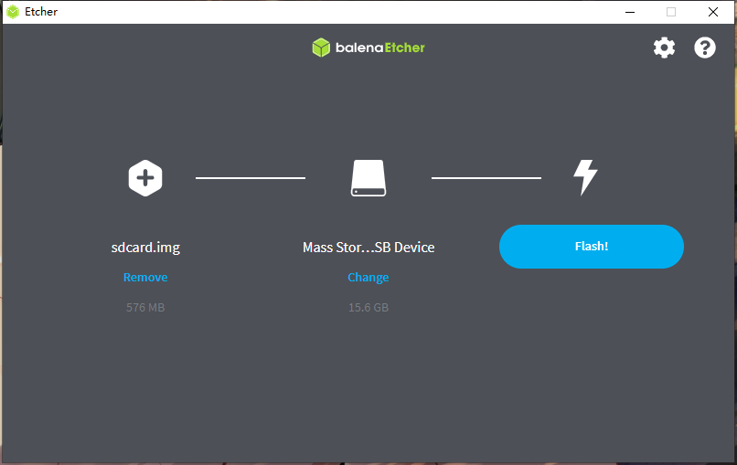
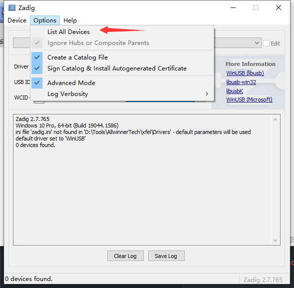
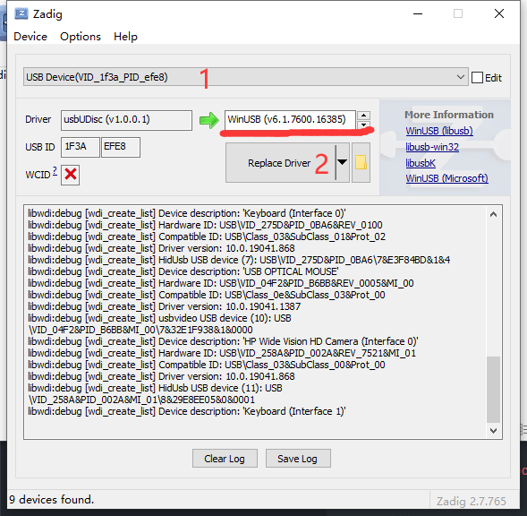

<h1 align="center">Buildroot for YuzukiSBC</h1>
<p align="center">Open Source development package for for yuzukihd Boards and more boards</p>

# Support Lists

✅: Supported — ❌: NOT support and will NOT support — ⚠️: Not Fully Supported Yet

|  Vender  | Device      | Chip    | U-Boot  | Linux   | Defconfig | SPI NOR | SPI NAND | SD CARD | EMMC | Support |
| -------- | ----------- | ------- | ------- | ------- | --------- | --------- | --------- | --------- | --------- | --------- |
| YuzukiHD | YuzukiRuler | F1C200s | 2020.07 | 5.4.180 | yuzukihd_yuzukiruler_defconfig | ✅ | ✅ | ✅ | ✅ | ✅ |
| YuzukiHD | YuzukiCore F1 | F1C200s | 2020.07 | 5.4.180 | yuzukihd_yuzukicore_f1_defconfig | ✅ | ✅ | ✅ | ✅ | ✅ |
| YuzukiHD | Yuzuki Mavericks | `F1C200s` | `2020.07` | `5.4.180` | `yuzukihd_yuzukimavericks_defconfig` | ✅ | ✅ | ✅ | ✅ | ✅ |
| YuzukiHD | YuzukiCK1N | V3x | 2022.01 | 5.4.180 | yuzukihd_yuzukick1n_defconfig | ❌ | ❌ | ✅ | ⚠️ | ⚠️ |
| YuzukiHD | R11 86 Panel | R11 | 2022.01 | 5.4.180 | yuzukihd_r11_86panel_defconfig | ✅ | ✅ | ❌ | ❌ | ✅ |
| Sipeed   | lichee nano | F1C100s | 2020.07 | 5.4.180 | sipeed_lichee_nano_defconfig | ✅ | ✅ | ✅ | ✅ | ✅ |
| Sipeed   | lichee zero | V3s | 2020.07 | 5.4.180 | sipeed_lichee_zero_defconfig | ❌ | ❌ | ✅ | ⚠️ | ✅ |
| awol   | nezha | D1-H | [tina,uboot 2018](https://github.com/Tina-Linux/tina-d1x-u-boot-2018) | [tina,linux 5.4.61](https://github.com/Tina-Linux/tina-d1x-linux-5.4) | awol_nezha_defconfig | ❌ | ❌ | ✅ | ❌ | ⚠️ |
| awol   | nezha-d1s | D1s | [tina,uboot 2018](https://github.com/Tina-Linux/tina-d1x-u-boot-2018) | [tina,linux 5.4.61](https://github.com/Tina-Linux/tina-d1x-linux-5.4) | awol_nezha_d1s_defconfig | ❌ | ❌ | ✅ | ❌ | ✅ |
| mangopi   | MQ | D1s | [tina,uboot 2018](https://github.com/Tina-Linux/tina-d1x-u-boot-2018) | [tina,linux 5.4.61](https://github.com/Tina-Linux/tina-d1x-linux-5.4) | mangopi_mq_defconfig | ❌ | ❌ | ✅ | ❌ | ✅ |
| mangopi   | MQ Dual | T113 | [tina,uboot 2018](https://github.com/Tina-Linux/tina-t113-u-boot-2018) | [tina,linux 5.4.61](https://github.com/Tina-Linux/tina-t113-linux-5.4) | mangopi_mq_dual_defconfig | ❌ | ❌ | ✅ | ❌ | ⚠️ |
| mangopi   | MQ Pro | D1-H | [tina,uboot 2018](https://github.com/Tina-Linux/tina-d1x-u-boot-2018) | [tina,linux 5.4.61](https://github.com/Tina-Linux/tina-d1x-linux-5.4) | mangopi_mq_pro_defconfig | ❌ | ❌ | ✅ | ❌ | ⚠️ |

# Install BSP

The recommended operating system is `Ubuntu 18.04 WSL` and `Ubuntu 20.04 WSL`. If you want to use a virtual machine or a physical machine running linux, please troubleshoot the problem by yourself. There is no solution here.

## Install necessary packages
```bash
sudo apt install rsync wget unzip build-essential git bc swig libncurses-dev libpython3-dev libssl-dev python3-distutils android-tools-mkbootimg
```

## Download Buildroot BSP

!> **Notice: Root permission is not necessery for download or extract.**

!> **For WSL2 Users: Please don't put this SDK in Windows partition, please put it under Linux partition, `/mnt/` must not appear in the path.**

```bash
git clone https://github.com/yuzukihd/Buildroot-YuzukiSBC
cd Buildroot-YuzukiSBC
```

<script id="asciicast-hYqCiFtIwwTQjLLidwG1w1EZk" src="https://asciinema.org/a/hYqCiFtIwwTQjLLidwG1w1EZk.js" async></script>

# Build firmware

## Setting up the build environment
!> **Notice: Root permission is not necessery for build firmware.**

!> Every time you set up, you will be prompted whether to check for updates, you can choose whether to check for updates

```
source envsetup.sh    # Set the build environment
lunch                 # Change to Buildroot Directory
```

<script id="asciicast-KhlmJTeKQXuOCc62I2MWKHjer" src="https://asciinema.org/a/KhlmJTeKQXuOCc62I2MWKHjer.js" async></script>

## Make the first build
!> **Notice: Root permission is not necessery for build firmware.**

### Apply defconfig
!> **Caution: Apply defconfig will reset all buildroot configurations to default values. Generally, you only need to apply it once.**

```bash
make *Defconfig Name*

eg.

make yuzukihd_yuzukiruler_defconfig
```

<script id="asciicast-BWL8PDRgC9BwydeD9vj0pamIu" src="https://asciinema.org/a/BWL8PDRgC9BwydeD9vj0pamIu.js" async></script>

### Regular build
```bash
make
```

### If changed DTS or kernel build
```bash
rebuild-kernel
```

### If changed Uboot, build
```bash
rebuild-uboot
```

### If added linux patches, build
```bash
sync_kernel
```

# Flashing Firmware

## Flashing to SD Card
### Using balenaEtcher

Download balenaEtcher at [https://www.balena.io/etcher/](https://www.balena.io/etcher/)



### Using dd
```
cd buildroot/output/images/              # To System img dir
sudo dd if=sdcard.img of=/dev/sdX bs=4M  # dd it
```

## Flashing to SPI-NAND

### Using sunxi-fel

Get sunxi-fel at [github.com/linux-sunxi/sunxi-tools](https://github.com/linux-sunxi/sunxi-tools/releases)

```bash
cd buildroot/output/images/                            # To System img dir
sunxi-fel -p spiflash-write 0 sysimage-nand.img        # Write System to devices
```

### Using XFEL

Get XFEL at [github.com/xboot/xfel](https://github.com/xboot/xfel/releases/)

!> XFEL Driver install [Instructions](/?id=xfel-driver-install)

```bash
cd buildroot/output/images/             # To System img dir
xfel spinand                            # Checkout device connection
xfel spinand write 0 sysimage-nand.img  # Write System to devices
```

## Flashing to SPI-NOR

### Using sunxi-fel

Get sunxi-fel at [github.com/linux-sunxi/sunxi-tools](https://github.com/linux-sunxi/sunxi-tools/releases)

```bash
cd buildroot/output/images/                            # To System img dir
sunxi-fel -p spiflash-write 0 sysimage-nor.img         # Write System to devices
```

### Using XFEL

Get XFEL at [github.com/xboot/xfel](https://github.com/xboot/xfel/releases/)

!> XFEL Driver install [Instructions](/?id=xfel-driver-install)

```bash
cd buildroot/output/images/            # To System img dir
xfel spinor                            # Checkout device connection
xfel spinor write 0 sysimage-nor.img   # Write System to devices
```

<script id="asciicast-470363" src="https://asciinema.org/a/470363.js" async></script>

# Development

## Buildroot built-in Scripts

```
Cleaning:
  clean                  - delete all files created by build
  distclean              - delete all non-source files (including .config)

Build:
  all                    - make world
  toolchain              - build toolchain
  sdk                    - build relocatable SDK

Configuration:
  menuconfig             - interactive curses-based configurator
  nconfig                - interactive ncurses-based configurator
  xconfig                - interactive Qt-based configurator
  gconfig                - interactive GTK-based configurator
  oldconfig              - resolve any unresolved symbols in .config
  syncconfig             - Same as oldconfig, but quietly, additionally update deps
  olddefconfig           - Same as syncconfig but sets new symbols to their default value
  randconfig             - New config with random answer to all options
  defconfig              - New config with default answer to all options;
                             BR2_DEFCONFIG, if set on the command line, is used as input
  savedefconfig          - Save current config to BR2_DEFCONFIG (minimal config)
  update-defconfig       - Same as savedefconfig
  allyesconfig           - New config where all options are accepted with yes
  allnoconfig            - New config where all options are answered with no
  alldefconfig           - New config where all options are set to default
  randpackageconfig      - New config with random answer to package options
  allyespackageconfig    - New config where pkg options are accepted with yes
  allnopackageconfig     - New config where package options are answered with no

Package-specific:
  <pkg>                  - Build and install <pkg> and all its dependencies
  <pkg>-source           - Only download the source files for <pkg>
  <pkg>-extract          - Extract <pkg> sources
  <pkg>-patch            - Apply patches to <pkg>
  <pkg>-depends          - Build <pkg>'s dependencies
  <pkg>-configure        - Build <pkg> up to the configure step
  <pkg>-build            - Build <pkg> up to the build step
  <pkg>-show-info        - generate info about <pkg>, as a JSON blurb
  <pkg>-show-depends     - List packages on which <pkg> depends
  <pkg>-show-rdepends    - List packages which have <pkg> as a dependency
  <pkg>-show-recursive-depends
                         - Recursively list packages on which <pkg> depends
  <pkg>-show-recursive-rdepends
                         - Recursively list packages which have <pkg> as a dependency
  <pkg>-graph-depends    - Generate a graph of <pkg>'s dependencies
  <pkg>-graph-rdepends   - Generate a graph of <pkg>'s reverse dependencies
  <pkg>-dirclean         - Remove <pkg> build directory
  <pkg>-reconfigure      - Restart the build from the configure step
  <pkg>-rebuild          - Restart the build from the build step
  <pkg>-reinstall        - Restart the build from the install step

busybox:
  busybox-menuconfig     - Run busybox menuconfig
  busybox-xconfig        - Run busybox xconfig
  busybox-gconfig        - Run busybox gconfig
  busybox-update-config  - Save the busybox configuration as a full .config file
                             to package/busybox/busybox.config
                             (or override with BUSYBOX_KCONFIG_FILE)

uboot:
  uboot-menuconfig       - Run uboot menuconfig
  uboot-xconfig          - Run uboot xconfig
  uboot-gconfig          - Run uboot gconfig
  uboot-nconfig          - Run uboot nconfig
  uboot-update-defconfig - Save the uboot configuration as a defconfig file
                             to board/sipeed/lichee-nano/config/uboot/uboot_sipeed_lichee_nano_defconfig
                             (or override with UBOOT_KCONFIG_FILE)
  uboot-update-config    - Save the uboot configuration as a full .config file
                             to board/sipeed/lichee-nano/config/uboot/uboot_sipeed_lichee_nano_defconfig
                             (or override with UBOOT_KCONFIG_FILE)

linux:
  linux-menuconfig       - Run linux menuconfig
  linux-xconfig          - Run linux xconfig
  linux-gconfig          - Run linux gconfig
  linux-nconfig          - Run linux nconfig
  linux-update-defconfig - Save the linux configuration as a defconfig file
                             to board/sipeed/lichee-nano/config/linux/linux_sipeed_lichee_nano_defconfig
                             (or override with LINUX_KCONFIG_FILE)
  linux-update-config    - Save the linux configuration as a full .config file
                             to board/sipeed/lichee-nano/config/linux/linux_sipeed_lichee_nano_defconfig
                             (or override with LINUX_KCONFIG_FILE)

Documentation:
  manual                 - build manual in all formats
  manual-html            - build manual in HTML
  manual-split-html      - build manual in split HTML
  manual-pdf             - build manual in PDF
  manual-text            - build manual in text
  manual-epub            - build manual in ePub
  graph-build            - generate graphs of the build times
  graph-depends          - generate graph of the dependency tree
  graph-size             - generate stats of the filesystem size
  list-defconfigs        - list all defconfigs (pre-configured minimal systems)

Miscellaneous:
  source                 - download all sources needed for offline-build
  external-deps          - list external packages used
  legal-info             - generate info about license compliance
  show-info              - generate info about packages, as a JSON blurb
  pkg-stats              - generate info about packages as JSON and HTML
  missing-cpe            - generate XML snippets for missing CPE identifiers
  printvars              - dump internal variables selected with VARS=...
  show-vars              - dump all internal variables as a JSON blurb; use VARS=...
                           to limit the list to variables names matching that pattern

  make V=0|1             - 0 => quiet build (default), 1 => verbose build
  make O=dir             - Locate all output files in "dir", including .config

For further details, see README, generate the Buildroot manual, or consult
it on-line at http://buildroot.org/docs.html
```

# Built-in Script

## For Environment

`wsl_path`

If you are using the `WSL` environment, please run this command to clear the `WSL` environment variables before compiling, otherwise the following error will occur.

```
Your PATH contains spaces, TABs, and/or newline (\n) characters.
This doesn't work. Fix you PATH.
support/dependencies/dependencies.mk:27: recipe for target 'dependencies' failed
make: *** [dependencies] Error 1
```

## For Build

`lunch`

Lunch 🚀 to buildroot.

`rebuild_kernel` = `mkernel` = `rkernel`

Delete the generated dtb and rebuild the kernel

`rebuild_uboot` = `muboot` = `ruboot`

Rebuild the U-Boot

`sync_kernel` 

Modify the kernel-related patch or need to restore the original kernel, sync to original

`sync_uboot` 

Modify the uboot-related patch or need to restore the original uboot, sync to original

# Appendix

## board file trees and file path definition

Buildroot-YuzukiSBC uses a custom directory structure, and the following descriptions need to be met when submitting code.

1. Do not use custom kernel, uboot and other repo, use patch to modify.
2. All configuration files and device trees are external and handed over to buildroot.
3. Common files, drivers, packaging scripts, etc. are placed in the `xxx-generic` folder.

```tree
├── Vender
│   ├── Board1
│   │   ├── config         # Place Defconfig
│   │   │   ├── linux      # Place Linux Defconfig
│   │   │   └── uboot      # Place U-boot Defconfig
│   │   ├── dts            # Place Device Trees for U-Boot and Linux (dts)
│   │   │   ├── linux      # Place Linux Device Trees (Mutifiles)
│   │   │   └── uboot      # Place U-boot Device Trees (Mutifiles)
│   │   ├── patch          # Place Patches
│   │   └── rootfs         # Rootfs Overlays
│   └── Board2
│       ├── config         # Place Defconfig
│       │   ├── linux      # Place Linux Defconfig
│       │   └── uboot      # Place U-boot Defconfig
│       ├── dts            # Place Device Trees for U-Boot and Linux (dts)
│       ├── patch          # Place Patches
│       │   ├── linux      # Place Patches for linux
│       │   └── uboot      # Place Patches for U-boot
│       └── script         # Place Script for uboot/linux
└── allwinner-generic      # Allwinner Generic Configs
    ├── suniv-f1c100s      # Chip Code - Chip Name
    │   ├── configs        # Place Default Defconfig
    │   │   ├── linux      # Place Linux Defconfig
    │   │   └── uboot      #
    │   ├── dts            # Place Device Trees (dtsi)
    │   │   ├── linux      # Device Trees For linux
    │   │   └── uboot      # Device Trees For U-boot
    │   ├── patch          # Place Patches
    │   │   ├── linux      # Place Patches for linux
    │   │   └── uboot      # Place Patches for U-boot
    │   └── rootfs         # Rootfs Overlays
    └── suniv-generic      # Chip Line Generic
```

## For Allwinner SUN20IW1P1 Platform

### OpenSBI-D1

For the sun20iw1p1(D1-H, D1s) platform, we introduced its stable version of OpenSBI as Supervisor Binary Interface. Which is not compatible with the upstream mainline OpenSBI. 

### post-build.sh

Since the main line currently lacks support for chips and has fewer drivers, the BSP kernel and U-boot are used here. The compilation method and startup method are quite different from the mainline. This script is used here as the connection.

Since Buildroot does not provide dedicated ARGS for Post Script, it is shared with `BR2_ROOTFS_POST_SCRIPT_ARGS`, so it needs to be written together with the packaging script here. 

#### Usage

```
post-build.sh -c xxxx.cfg      <platform> <target dtb>
              ^for pack image  ^for post-build.sh
```

In config

```
BR2_ROOTFS_POST_SCRIPT_ARGS="-c board/awol/nezha-d1s/script/genimage.cfg   sun20i-d1s         sun20i-d1s-nezha-linux.dtb"
                             ^for pack image                               ^target platform name  ^device tree
```

## XFEL Driver install

First, open zadig under the XFEL driver folder and select `List All Devices`



Then select Allwinner USB Device `VID_1f3a_PID_efe8`, and replace the driver with WinUSB


